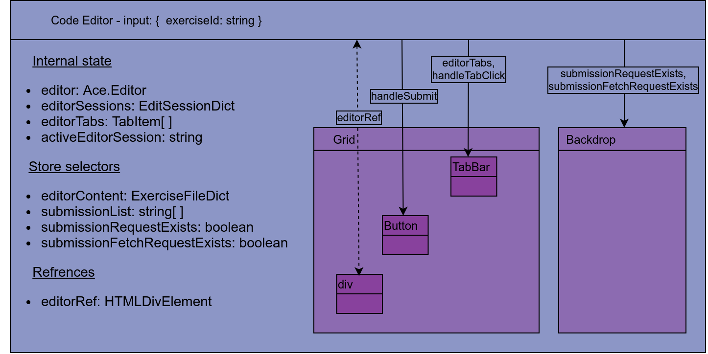

# Konekoe online code editor

This project is an online code editor designed for remote online exams. After cloning the repository, you an install dependencies with

``npm install``

Unit tests can be run with:

``npm test``

Additionally, the project includes End-To-End test implemented with [cypress](https://www.cypress.io).

For the E2E test to function, the development server has to be running.

Run the development server with:

``npm start``

It will start in port 8080.

E2E tests can then be run with:

``npm run cypress:run``

By default the tests are run in Electron. To run the tests in a specific browser, a command line argument can be used:

``npm run cypress:run -- --browser chrome``

The above command will try to run the tests with a local install of chrome.

Additionally, E2E tests can be run with:

``npm run cypress:open``

This will open a GUI for controlling the execution.

The project is developed with TypeScript and has to be transpiled for usage outside of testing.

Build with webpack with:

``npm run build``

Notice that the project includes a submodule called *konekoe-editor-release*, which contains the latest build of the project.

## Table of contents
1. [Most important dependencies](#1-most-important-dependencies)
2. [Application architecture](#2-application-architecture)
3. [Structure of Redux store](#3-structure-of-redux-store)
4. [Descriptions of core components](#4-descriptions-of-core-components)
    1. [CodeEditor](#4-1-codeeditor)
    2. [CodeTerminal](#4-2-codeterminal)
    3. [InfoBox](#4-4-infobox)
5. [Server-Client interface](#5-server-client-interface)

## 1. Most important dependencies

The project is developed with [TypeScript](https://www.typescriptlang.org) and can be transpiled with [webpack](https://webpack.js.org). The *tsconfig.json* contains the project's TypeScript configuration and the *webpack.config.json* file the webpack configuration.

Unit tests are written with [Jest](https://jestjs.io). More specifically, the used preset is *ts-jest* and [ts-jest](https://www.npmjs.com/package/ts-jest) is utilized for preprocessing the tests. The *jest.config.json* file contains the project's jest configuration. Notice the *setupFilesAfterEnv* field which points to the file *setupTests.ts*. This file includes imports for
matchers and mocks utilized by the unit tests.

The UI elements are implemented as [React function components](https://reactjs.org/docs/getting-started.html). Some componentes have their own internal state handled with React hooks, but the entire application also has an internal store implemented with [Redux](https://redux.js.org). The React components utilize [React-Redux](https://react-redux.js.org) for interactions with the store. Additionally, the *web socket message handler* utilizes [Redux-Toolkt](https://redux-toolkit.js.org/usage/usage-with-typescript/).

For styling the UI, the project utilizes [Material-UI](https://material-ui.com).

Additionally, the core React components utilize libraries which will be discussed in section 4.

## 2. Application architecture 

In the above diagram, the boxes with a headers are React components. The color scheme along with the hierarchy of the boxes represents the depth of the components (how deep is the nesting). The arrows indicate passing of input values to child elements. Notably, with the React components the input values are passed as React props. 

The root of the application is in the *src/index.tsx* file. Here the Redux store instance is created and the application mounted on the page expressed in the diagram as *document*. The application expects to find an HTML element with the id *root* and will attach the *App* component enclosed in a [React-Redux Provider](https://react-redux.js.org/api/provider) to this element. The Provider provides React components with access to the application store through the [Hook API](https://react-redux.js.org/api/hooks).

Notice how the store instance is also passed to App as a prop. This is to provide the message handler object with access to the store as well. Additionally, App expects to receive a JSON Web Token and a WebSocket address as props. These values are expected to be found as data attributes on the root HTML element onto which the application is mounted.

Notice the bullet list of values inside of App. These values are variables which are passed down to child components. Notably, *selectedExercise* is part of the internal state of App and controlled with the [useState hook](https://reactjs.org/docs/hooks-state.html). The other values are produced with [selector hooks](https://react-redux.js.org/api/hooks#useselector) from the Redux store. 

The three core React component, CodeEditor, CodeTerminal and InfoBox, are discussed in detail in section 4. However, the above diagram also includes the MessageHandler object and components for error handling. The application's error handling utilizes the Redux store as well as [react-error-boundary](https://github.com/bvaughn/react-error-boundary#:~:text=%20react-error-boundary%20%201%20The%20problem.%20React%20v16,error.%20This%20will...%206%20LICENSE.%20%20More%20). Uncaught errors are caught by the error boundary inside of App. Three types of errors exist: critical, minor and messaging errors. Notably, only critical and minor errors have a distinct visualization tied to them. Messaging errors are produced by the server-client interface and will result in either a minor or critical error. A critical error is anologoues to a crash and represents a state from which the application can't proceed. For instance, an error during authentication caused by a malformed JWT will result in a critical error. Critical errors are visualized as an overlay displaying the error message. The overlay can't be removed and the application no longer used without refreshing the page. Minor errors are visualized with a modal displaying a title and an accompanying message. These errors don't halt the application's execution and are strictly informative. For instance, during a code submission the server might encounter a syntax error in the submitted code. This will produce a minor error (first received as a message error) which is displayed to the user. All errors are pushed to the Redux store and then consumed by App.

## 3. Structure of Redux store

The application's Redux store is divided into four [slices](https://redux-toolkit.js.org/api/createslice/). Each slice represents a conceptual subsection of the store which are:

* errors
* exercises
* submissions
* terminal data

The error slice contains state for storing errors and action creaters for registering and consuming errors. The *push* action creator handles registering of all types of errors. Minor errors are pushed onto a stack. Notably, only a single critical error can be placed in the state. A message error is interpreted as minor or critical error and the handled accordingly. The slice also contains action creators for popping minor erros from the stack and clearing message errors. Notably, the later action creator and its target state section are not utilized in the current version of the application.

The exercise slice contains points, titles and descriptions for each of the exercises. The values are stored as dictionaries accessed with an exercise id. The slice also provides action creators for initializing the state and updating point values. Therefore, titles and descriptions are treated as immutable values.

The submission slice contains state values related to exercise submissions. Each exercise is associated with a list of submission ids. These are ids for submissions the user has made. Along with the list of submission ids, an exericse is associated with an active submission. This submission is shown to the user and the state contains the files associated with the submission. Note that the files stored in the Redux store are not directly editted by the code editor. Instead they are fetched into the store and the values are copied into the editor. Additionally, each exercise can also be associated with a submission request and a fetch request. A submission request contains the code being sent for grading. A fetch request contains a submission id for fetching the associated submission files from the server.

The terminal slice houses data to shown in the terminal component. Terminal data is exericse specific and therefore stored in a dictionary accessed with an exercise id. Data can be added with an action creator and later read with a selector. Terminal data associated with an exercise can also be cleared. Notably, the slice contains functionality for dealing with input data but as of writing this functionality is not utilized.

## 4. Descriptions of core components

This section covers the core React components, their usage of the Redux store and packages they utilize. In the diagrams, the bulleted lists represent internal values of the component. Note that the file *src/types.ts* contains type definitions, excluding external ones such as Ace.Editor, utilized in the project.

### 4.1. CodeEditor

The diagram above illustrates the structure of the CodeEditor component. [Ace](https://ace.c9.io/index.html) is utilized for creating an editor view. CodeEditor creates an instance of the Ace.Editor class and mounts it on a div element. For the mounting a [reference](https://reactjs.org/docs/refs-and-the-dom.html) is created and utilizing an effect hook, the corresponding element is fetched. Note that this means that the Ace.Editor instance, the actual code editing element, only becomes available after the initial render of the CodeEditor component. 

The CodeEditor utilizes its internal state to store Ace.EditorSession instances and a string id pointing to the currently active session. In practice, each session represents a file in edit. The sessions are created from the value of the *editorContent* selector. Notice that the EditorSessions are stored per *exerciseId*. When the exerciseId prop changes value, new EditorSessions are created. Therefore, unsubmitted edits made to the files can be lost. This limitation should be addressed in future versions.

The component utilizes a Semantic-UI Grid for laying out its child components. A TabBar is utilized for selecting a file for editing. The TabBar receives as props an array of tab items and a selection callback function. Each tab is associated with a file and a file id found functioning as a key in the editorSessions dictionary. The selection handler callback updates the value of *activeEditorSession* based on the id of the selected tab. Along with the TabBar, the Grid includes a button for submitting the contents of the EditorSessions. Notably, a submission creates a *submissionRequest* which is pushed into the Redux store. As long as the request exists, an overlay becomes visible blocking the user from making submissions or editing the associated files. The overlay is implemented with the *Backdrop* element displayed in the diagram. Notice that the Backdrop also accepts a flag for a *submissionFetchRequest* as input. A submission fetch request is made whenever code files are fetched from the server. The CodeEditor creates the requests ondemand on when the *exerciseId* prop changes fetching the submission associated with the first value in the *submissionList*. Lastly, the Grid contains a div element onto which the Ace.Editor instance is mounted. 

### 4.2. CodeTerminal

The above diagram illustrates the CodeTerminal component. [XTerm.js](https://xtermjs.org) is utilized for implementing the terminal. The component creates and instance of the Terminal class and utilizing a refrence mounts it on a div element. Additionally, [the fit addon](https://github.com/xtermjs/xterm.js/tree/master/addons/xterm-addon-fit) is utilized for determining the dimensions of the terminal. Note that the fit addon might print error messages on initial render as it will determine the dimesnions to be infinite. This will not break anything but might cause confusion say when you are running the unit tests. 

The CodeTerminal displays exercise specific terminal output received from the server. The *terminalContent* selector fetches a dictionary of values from the Redux store which is the accessed with the *exerciseId* provided as a prop. The contents of the dictionary are written into the Terminal instance. 

Additionally, a button is provided for clearing the terminal data associated with the active exercise. Notice that the *handleClearClick* callback dispatches a clear action to the Redux store and also resets the Terminal instance's internal buffers. In fact, it's good to note that both the store and the Terminal instance store the values independently and the CodeEditor bridges the gap between them.

### 4.1. InfoBox

The InfoBox component has no internal state. It is passed a Markdown string as a prop which it the renders as HTML. The input string is passed to [marked](https://marked.js.org) which transforms the Markdown into HTML. Then [sanitize-html](https://www.npmjs.com/package/sanitize-html) is utilized to sanitize the resulting HTML.

## 5. Server-Client interface

The server-client interface utilizes [WebSockets](https://developer.mozilla.org/en-US/docs/Web/API/WebSocket) for communication. The client side is implemented by the *WebSocketMessageHandler* class. The table below is comprised of the different message types and their usage.

| Type        | Client           | Server  | Result of communication |
| --- |:------:| :---:| :--- |
| `server_connect` | Sends `{ token: string }` to the server. The token is a JWT used for authenticatoin.  | Responds with  `{ exercises: Exercise[ ] }` or `{ error: CriticalError }` | The *exercise slice* is initilized or a critical error is pushed to the store |
| `code_submission` | Sends `{ exerciseId: string, files: FileData[] }`. | Responds with `exerciseId: string, points: number, maxPoints: number` or `{ exerciseId: string, points: 0, maxPoints: 0, error: MessageError }` | The submissions request associated with the exericse id is cleared. If an error is received, it is pushed to the store. If no error is received, points will be updated. The point update will choose the maximum between the currently stored value and the one received for the submission. |
| `terminal_output` |  | Sends `exerciseId: string, data: string`  | The received data is written to the store. Note that the client overwrites the current value entirely. |
| `submission_fetch` | Sends `exerciseId: string, submissionId: string`. The *submissionId* defaults to DEFAULT. | Responds with `exerciseId: string, submissionId: string, date: Date, points: number, files: FileData[]` or `exerciseId: string, submissionId: string, error: MessageError`  | The submission fetch request associated with the exerciseId is cleared. If no error is received, the *currentlyActive* field in the *submission slice* is updated with the received valued. If an error is recieved, it is pushed to the store.  |

